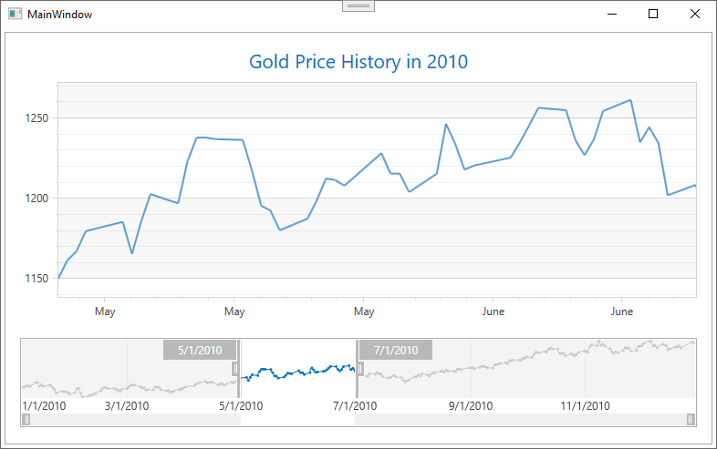

<!-- default badges list -->

<!-- default badges end -->

# WPF - How to Bind a Range Control to a Chart Control 

This example demonstrates how to use a Range Control for navigation within a Chart Control.

To do this, create a chart client for the Range Control. Then specify a&nbsp;client&nbsp;data source with the&nbsp;<a href="https://documentation.devexpress.com/#WPF/DevExpressXpfChartsRangeControlClientChartRangeControlClient_ItemsSourcetopic">ChartRangeControlClient.ItemsSource</a>&nbsp;content&nbsp;property. Define which data fields are used to obtain chart client arguments and values with&nbsp;the&nbsp;<a href="https://documentation.devexpress.com/#WPF/DevExpressXpfChartsRangeControlClientChartRangeControlClient_ArgumentDataMembertopic">ChartRangeControlClient.ArgumentDataMember</a>&nbsp;and&nbsp;<a href="https://documentation.devexpress.com/#WPF/DevExpressXpfChartsRangeControlClientChartRangeControlClient_ValueDataMembertopic">ChartRangeControlClient.ValueDataMember</a>&nbsp;properties. To manage data ranges within the Chart Control with the Range Control, bind the&nbsp;<a href="https://documentation.devexpress.com/#WPF/DevExpressXpfChartsRange_MinValuetopic">Range.MinValue</a>&nbsp;and&nbsp;<a href="https://documentation.devexpress.com/#WPF/DevExpressXpfChartsRange_MaxValuetopic">Range.MaxValue</a>&nbsp;property values of the Chart Control visual range to the&nbsp;<a href="https://documentation.devexpress.com/#WPF/DevExpressXpfEditorsRangeControlRangeControl_SelectionRangeStarttopic">RangeControl.SelectionRangeStart</a>&nbsp;and&nbsp;<a href="https://documentation.devexpress.com/#WPF/DevExpressXpfEditorsRangeControlRangeControl_SelectionRangeEndtopic">RangeControl.SelectionRangeEnd</a>&nbsp;property values respectively. Also, bind the&nbsp;<strong>Range.MinValue</strong>&nbsp;and&nbsp;<strong>Range.MaxValue</strong>&nbsp;property values of the whole range to the <a href="https://documentation.devexpress.com/#WPF/DevExpressXpfEditorsRangeControlRangeControl_VisibleRangeStarttopic">RangeControl.VisibleRangeStart</a>&nbsp;and&nbsp;<a href="https://documentation.devexpress.com/#WPF/DevExpressXpfEditorsRangeControlRangeControl_VisibleRangeEndtopic">RangeControl.VisibleRangeEnd</a>&nbsp;property values.

## Files to Review

* [MainWindow.xaml](./CS/GoldPrices/MainWindow.xaml) (VB: [MainWindow.xaml](./VB/GoldPrices/MainWindow.xaml))
* [MainWindow.xaml.cs](./CS/GoldPrices/MainWindow.xaml.cs) (VB: [MainWindow.xaml.vb](./VB/GoldPrices/MainWindow.xaml.vb))

## Documentation

* [Chart Clients for the Range Control](https://docs.devexpress.com/WPF/16847/controls-and-libraries/charts-suite/chart-control/chart-clients-for-the-range-control)

<h3>Description</h3>

To do this, create a chart client for the Range Control. Then specify a&nbsp;client&nbsp;data source using the&nbsp;<a href="https://documentation.devexpress.com/#WPF/DevExpressXpfChartsRangeControlClientChartRangeControlClient_ItemsSourcetopic">ChartRangeControlClient.ItemsSource</a>&nbsp;content&nbsp;property. Define which data fields will be used to obtain chart client arguments and values using&nbsp;the&nbsp;<a href="https://documentation.devexpress.com/#WPF/DevExpressXpfChartsRangeControlClientChartRangeControlClient_ArgumentDataMembertopic">ChartRangeControlClient.ArgumentDataMember</a>&nbsp;and&nbsp;<a href="https://documentation.devexpress.com/#WPF/DevExpressXpfChartsRangeControlClientChartRangeControlClient_ValueDataMembertopic">ChartRangeControlClient.ValueDataMember</a>&nbsp;properties. To manage data ranges within the Chart Control using the Range Control, bind the&nbsp;<a href="https://documentation.devexpress.com/#WPF/DevExpressXpfChartsRange_MinValuetopic">Range.MinValue</a>&nbsp;and&nbsp;<a href="https://documentation.devexpress.com/#WPF/DevExpressXpfChartsRange_MaxValuetopic">Range.MaxValue</a>&nbsp;property values of the Chart Control visual range to the&nbsp;<a href="https://documentation.devexpress.com/#WPF/DevExpressXpfEditorsRangeControlRangeControl_SelectionRangeStarttopic">RangeControl.SelectionRangeStart</a>&nbsp;and&nbsp;<a href="https://documentation.devexpress.com/#WPF/DevExpressXpfEditorsRangeControlRangeControl_SelectionRangeEndtopic">RangeControl.SelectionRangeEnd</a>&nbsp;property values respectively. Also, bind the&nbsp;<strong>Range.MinValue</strong>&nbsp;and&nbsp;<strong>Range.MaxValue</strong>&nbsp;property values of the whole range to the <a href="https://documentation.devexpress.com/#WPF/DevExpressXpfEditorsRangeControlRangeControl_VisibleRangeStarttopic">RangeControl.VisibleRangeStart</a>&nbsp;and&nbsp;<a href="https://documentation.devexpress.com/#WPF/DevExpressXpfEditorsRangeControlRangeControl_VisibleRangeEndtopic">RangeControl.VisibleRangeEnd</a>&nbsp;property values.

 

